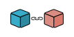

<p align="center">
  
</p>

<h1 align="center">BlockLite</h1>

<p align="center">
  <b> An experimental blockchain implementation written from scratch in Go! </b>
</p>

<p align="center">

  
  
  
  
</p>

## Overview

BlockLite aims to build a blockchain from the ground up, with plans to introduce a cryptocurrency called **MaskedCoins**. The current codebase includes a basic blockchain structure with proof-of-work consensus, RESTful APIs, and supporting utilities, with more features in development.

## Features
- **Blockchain Core**: Implements a simple blockchain with blocks containing index, timestamp, proof, and previous hash.
- **Proof of Work**: Uses a basic PoW algorithm requiring 4 leading zeros in the hash.
- **API Endpoints**: Provides RESTful APIs via Gin to interact with the blockchain (e.g., get blocks, mine new blocks).


## Getting Started

### Prerequisites

- Go (1.18+)
- Git

### Installation

1. Clone the repository:
   ```bash
   git clone https://github.com/maskedsyntax/blocklite.git
   cd blocklite
   ```

2. Install dependencies:
   ```bash
   go mod tidy
   ```

3. Install `air` for live reloading:
   ```bash
   go install github.com/air-verse/air@latest
   ```

> [!IMPORTANT]
> Ensure `air` is in your PATH to execute it successfully.  

### Run the Project
- Start the server with live reloading:
  ```bash
  air
  ```
- Access the API at `http://localhost:8080` (configurable via `PORT` environment variable).

## Development
- **Live Reloading**: Changes in `.go` files trigger restarts via `air`. The `/tmp` folder is temporary and ignored in version control.
- **Testing**: Run tests with:
   ```bash
   go test ./...
   ```

## Contributing
This is a personal project, but feel free to fork and submit pull requests. Feedback is welcome!

## License
This project is licensed under the [MIT License](LICENSE). See the `LICENSE` file for details.

> [!NOTE]
> Updates on `MaskedCoins` and future features will be shared as they progress. 
